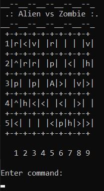

# Alien vs. Zombie

This is a game called Alien Vs Zombie. The objective of this game is to use the Alien to kill all the zombies in the gameboard. You can use mulltiple command or abilities to help you to achieve that goal. The Alien will spawn at the center of the gameboard and the zombies will spawn at random places at the gameboard. There is elements such as pod and health items that you can collect to assist you. Beware of rocks and borders as it can stops you from moving ! kill the zombies before it kills you. Enjoy the game !

[Video Demo](https://youtu.be/eVvWiT0gbQE).

## Compilation Instructions

1. Download the cpp file that contains the main code of the game.
2. Run the code in the cmd (to avoid any errors) 

## User Manual

Please refer user manual pdf in the repository

## Progress Log

- [Part 1](PART1.md)
- [Part 2](PART2.md)

## Contributors

Please replace the following with your group members' names. 

- MUHAMMAD AFIQ DANISH BIN SUNARDI - 1211103424
- MUHAMMAD AMIR ADIB BIN MOHD AMINUDDIN - 1211103233
- HAKEEM BIN AMINUDIN - 1211103830

